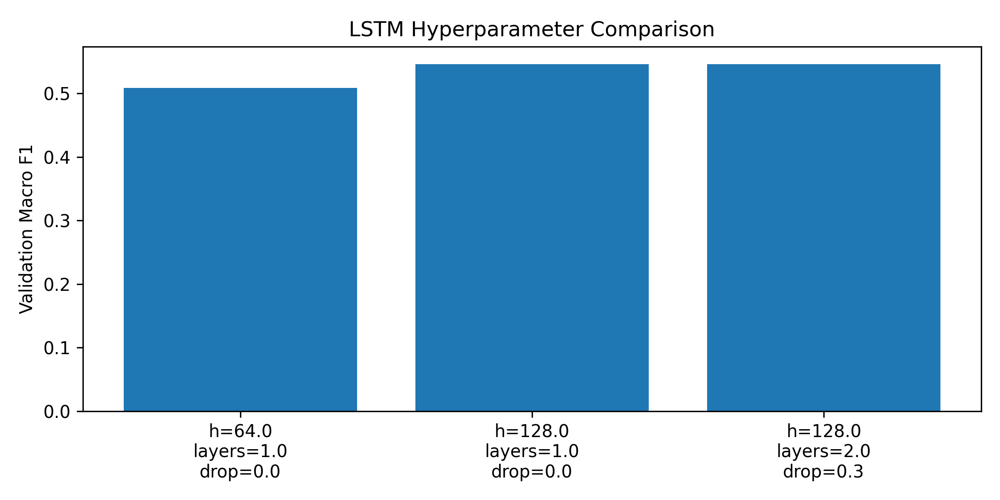
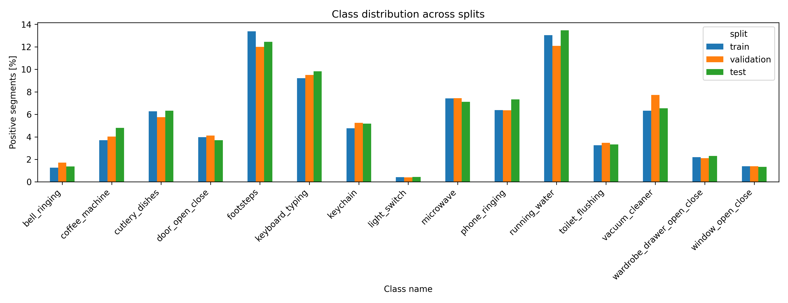
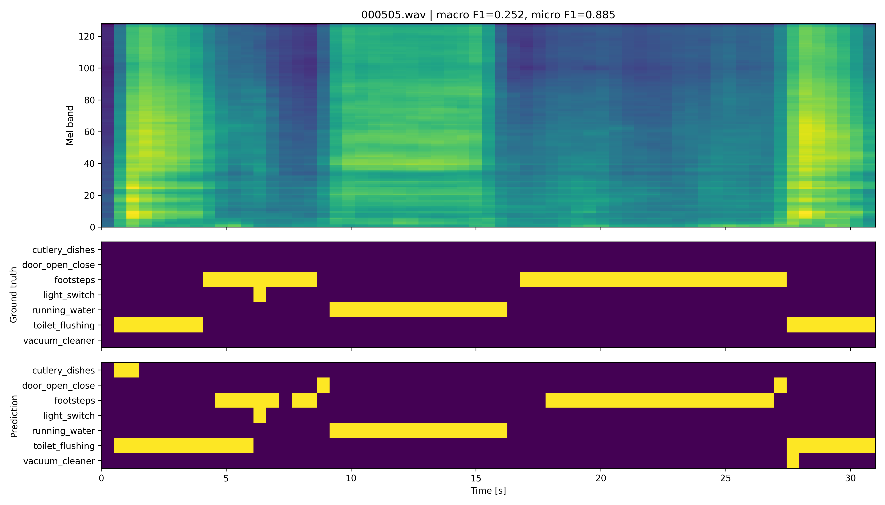
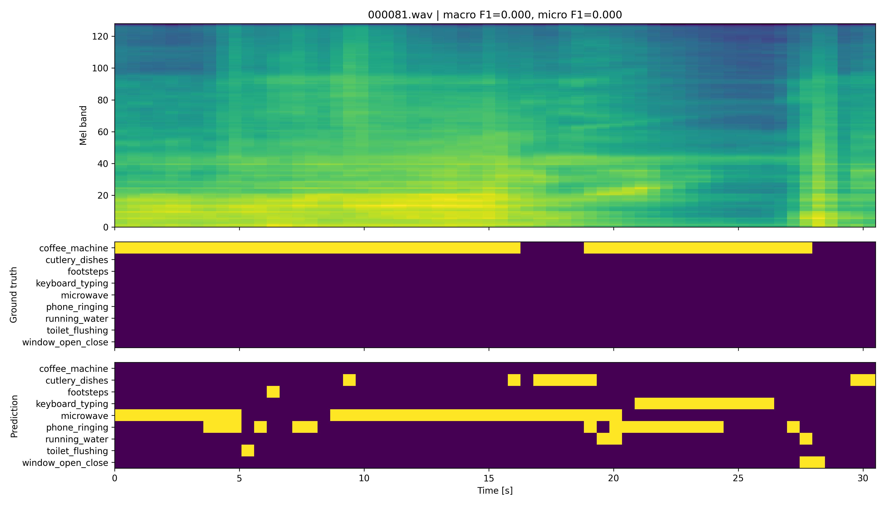

# Domestic Sound Event Detection with Classical and Deep Models

This repository contains our course project for **Machine Learning and Pattern Classification (MLPC 2026)** at JKU Linz.
The goal is to detect overlapping household sounds in long audio recordings and convert the predictions into event intervals of the form

```text
filename, annotation, onset, offset
```

The task is **polyphonic and multi-label**: several of the 15 target sound classes may be active at the same time.
Evaluation is based on macro F1 at one-second resolution.

## Project overview

We explored two related settings:

1. **Segment classification** using precomputed acoustic features and recording-level train/validation/test splits.
2. **Full sound event detection** using the official challenge splits and evaluator.

The main comparison covers simple baselines, logistic regression, Random Forest, LSTM and a CRNN operating directly on log-mel spectrograms.

---

## Main results

### Official SED challenge

| System | Macro F1 |
|---|---:|
| Provided decision-tree baseline | 0.3170 |
| Random Forest, threshold 0.25 | 0.4178 |
| **CRNN** | **0.7147** |

The CRNN achieved the best official score by a large margin. Its main advantage is the use of temporal context: instead of treating every one-second segment independently, it models how events evolve over time.

### Segment classification on our own split

| Model | Macro F1 | Micro F1 | Samples F1 |
|---|---:|---:|---:|
| Always-zero baseline | 0.0000 | 0.0000 | 0.0000 |
| Frequency baseline | 0.0567 | 0.0825 | 0.0489 |
| Logistic regression | 0.3556 | 0.3854 | 0.3380 |
| **LSTM** | **0.5459** | **0.6207** | **0.4818** |

> The two result tables use different splits and evaluation pipelines. Their values should therefore be interpreted separately rather than compared directly.



---

## Data preparation

### Aggregating multiple annotations

Every recording was labelled by several annotators. The resulting annotation tensor has shape
`[T, C, A]`, where `T` is the number of one-second segments, `C` the number of classes and `A` the number of annotators.
Values between 0 and 1 represent how much of a segment is covered by an event.

We convert these annotations into binary labels with a **weighted majority vote**:

- an annotator votes positive when at least 50% of the segment is covered;
- annotators who recorded the audio themselves receive double weight;
- a class is active when the weighted positive votes exceed half of the available weight.

This approach is transparent and robust to isolated annotation errors. Its main limitation is that the additional collector weight may introduce recall bias, while the hard threshold removes uncertainty from partial or conflicting annotations.

### Recording-level splitting

Train, validation and test sets are split by recording rather than by individual segments.
This prevents neighbouring segments from the same room, device and acoustic background from appearing in multiple splits.

To improve class balance, several grouped splits are sampled and the candidate with class frequencies closest to the full dataset is selected.

| Split | Segments | Recordings |
|---|---:|---:|
| Train | 117,678 | 2,559 |
| Validation | 25,304 | 548 |
| Test | 25,257 | 549 |

No filename overlap was found between the three splits. Every class is represented in each split, including rare events such as `light_switch`.

A stricter collector-level split would reduce the risk that recordings from the same person share similar rooms or devices. We kept recording-level grouping because it produced substantially better class balance; the remaining collector similarity is a known limitation.



### Feature extraction

For the feature-based models, all numeric two-dimensional arrays from the provided `.npz` files are concatenated.
These include:

- MFCCs and first/second derivatives
- mel-spectrogram statistics
- energy and power
- spectral centroid, bandwidth, contrast, flatness, flux and rolloff
- zero-crossing rate

Mean, standard deviation, minimum and maximum are used as aggregation statistics, resulting in **960 features per segment**.
The Random Forest uses a selected subset of 464 features.

Standardization is performed with `StandardScaler` fitted on the training set only and then applied unchanged to validation and test data.

---

## Why macro F1?

The dataset is highly imbalanced. Common events such as `footsteps` and `running_water` occur in roughly 13% of segments, whereas `light_switch` appears in less than 0.5%.

Accuracy would therefore reward models that predict almost nothing. Macro F1 computes F1 independently for each class and gives rare classes the same influence as frequent ones, making it the more meaningful selection criterion for this task.

---

## Models

### Baselines

The always-zero predictor provides a sanity floor of 0.0 macro F1.
The frequency baseline samples each class independently according to its empirical training frequency and reaches 0.0567 macro F1.

### Logistic regression

A separate class-balanced `SGDClassifier` is trained for each class in a one-vs-rest setup.
The best validation regularization strength was `alpha = 1e-3`.

The model reaches 0.3556 test macro F1. Its macro recall of 0.749 is much higher than its macro precision of 0.250, showing that it detects many events but also produces a large number of false positives.

### LSTM

The one-second segments are regrouped into recording-level sequences so the model can use temporal dependencies.
Variable-length recordings are padded and masked, and padded steps are excluded from the loss.
Training uses `BCEWithLogitsLoss` with per-class positive weights.

| Hidden size | Layers | Dropout | Validation macro F1 |
|---|---:|---:|---:|
| 64 | 1 | 0.0 | 0.5088 |
| 128 | 1 | 0.0 | **0.5463** |
| 128 | 2 | 0.3 | 0.5459 |

The final LSTM reaches 0.5459 macro F1 on the test set, confirming that temporal context adds information that a segment-wise linear classifier cannot capture.

### Random Forest

The Random Forest uses 100 trees, `max_depth=20`, `min_samples_leaf=2` and `class_weight="balanced_subsample"` on 464 selected features.

Threshold tuning had a larger impact than changing the tree hyperparameters. Lowering the decision threshold from 0.50 to 0.25 improved development macro F1 from 0.2501 to 0.4269. The final exported system scores 0.4178 with the official evaluator.

### CRNN

The end-to-end model follows this pipeline:

```text
log-mel spectrogram
        ↓
convolutional blocks with frequency pooling
        ↓
bidirectional GRU
        ↓
frame-level probabilities for 15 classes
        ↓
one-second pooling and event conversion
```

The CRNN is trained for 70 epochs using AdamW, cosine learning-rate scheduling, dropout and positive class weights.
Its internal validation macro F1 is 0.7141, while the official evaluator reports 0.7147.

---

## Observations from the experiments

### Threshold selection is crucial

For the Random Forest, changing the decision threshold improved macro F1 more than any tested hyperparameter adjustment.
Rare classes are often predicted with lower confidence, so a default threshold of 0.50 suppresses many true positives.

### Temporal smoothing was not beneficial

Median filtering with a window size of 3 slightly increased micro F1 from 0.5124 to 0.5263, but reduced macro F1 from 0.4269 to 0.4130.
Smoothing removes isolated false positives, but it can also delete correctly detected short events.

### Long events are easier than short impulses

The strongest LSTM class scores were obtained for:

- `running_water`: 0.794
- `keyboard_typing`: 0.754
- `vacuum_cleaner`: 0.709
- `microwave`: 0.694

The weakest classes included:

- `light_switch`: 0.145
- `window_open_close`: 0.312
- `wardrobe_drawer_open_close`: 0.325

Long, stable sounds are easier to identify from one-second segments. Short transient events may occupy only a small part of a segment and are easily confused with one another.

### Precision remains the main weakness

Across the tested models, recall is consistently higher than precision.
Class weighting helps rare events become learnable, but it also increases false positives.
Class-specific thresholds would be a useful next improvement.

---

## Qualitative examples

### Successful recording



For `000505.wav`, the model detects several long and distinctive events reliably, reaching a micro F1 of 0.885.
Most errors occur around event boundaries, where only part of a one-second segment contains the target sound.

### Failure case



For `000081.wav`, the model produces no true positives.
The recording mainly contains `coffee_machine`, while the predictions are dominated by `microwave` and `keyboard_typing`.
These classes share a continuous appliance-like spectral character, so confusing them causes both macro and micro F1 to drop to 0.000 despite a plausible overall prediction density.

---

## Repository structure

```text
src/
  data_prep.py         feature loading and label aggregation
  data_split.py        grouped splitting and leakage checks
  baseline_logreg.py   frequency baseline and logistic regression
  lstm.py              LSTM training, tuning and evaluation
  crnn_sed.py          end-to-end CRNN training
  predict.py           CRNN inference on the validation set
  case_study.py        qualitative per-recording analysis
  evaluate.py          official challenge evaluator
results/
  figures/             plots used in this README
  tables/              evaluation summaries and class reports
docs/
  reports and presentation slides
```

The `outputs/` directory stores generated feature files, checkpoints and predictions. It is created locally and excluded from version control.

The Random Forest implementation described above and the course-provided baseline notebook are not part of the published repository.

---

## Installation

```bash
pip install -r requirements.txt
```

The feature-based models run on CPU.
For the CRNN, install `torchaudio` and `soundfile`; GPU acceleration is strongly recommended.

```bash
pip install torch torchaudio --index-url https://download.pytorch.org/whl/cu124
pip install soundfile
```

---

## Running the experiments

### Feature-based pipeline

```bash
python src/data_prep.py        # creates outputs/prepared_data.npz
python src/data_split.py       # creates outputs/split_data.npz
python src/baseline_logreg.py  # baselines and logistic regression
python src/lstm.py             # LSTM training and evaluation
python src/case_study.py       # qualitative examples
```

### CRNN pipeline

```bash
python src/crnn_sed.py         # training and test-set submission
python src/predict.py          # validation inference
python src/evaluate.py         # official evaluation
```

### Expected data layout

```text
Data/
  metadata.csv
  annotations.csv
  audio_features/*.npz

train/
validation/
test/
  annotations.csv
  metadata.csv
  audio/*.wav
```

The feature-based scripts expect the `Data/` directory.
The CRNN reads the `train/`, `validation/` and `test/` folders directly; the test folder contains audio only.

---

## Data availability

The dataset is licensed for use within the course and is therefore **not included** in this repository.
The code is published for reference, but reproducing the experiments requires access to the original course data.

---

## Authors

**Erik Brandmair and Theodor Senk**  
Machine Learning and Pattern Classification, JKU Linz, 2026
